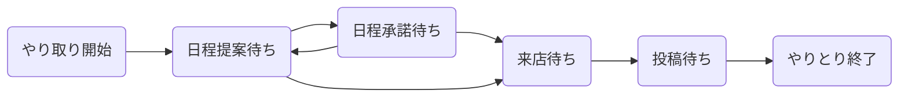

# こんにちは！

広く浅く系エンジニアです。人を動かす仕組みづくりが好きです。新卒就活中は「ものづくりを通して多くの人間に貢献したい。かつ、その開発は全部自分でやりたい。が物理的に無理なので会社を使う」的なことを言っていました。青いですね。

最近は、プロダクトじゃなく組織を通して、ユーザじゃなくメンバーをを動かす方に仕事がシフトしつつあります。

|  | 経験      | 概要 |
|---|---|---|
| 1 | Android | ライブ配信アプリのAndroidを開発してました。丁度Kotlinの波が押し寄せたくらいの時期です。Javaコードを徐々に減らしていったり、[AAC](https://developer.android.com/topic/libraries/architecture)を導入したり、MVVMとかCleanArchitecureに目を輝かせたりRecyclerViewに四苦八苦したりしていました。JetPackが現れ始めたくらいの時期で終了しました。 | 
| 2 | iOS | Androidの成長曲線が緩やかになった頃合いで、「Androidのビルド待ち時間にiOS開発できたら最強じゃね？」と思い始めました。今でも覚えてるのはenum (associated value) 便利だったなぁってのとReactiveSwiftの難しかったなぁっていう点くらいで、それほど込み入ったことはしていません。それでも、XCodeの使い方、証明書の概念、アーカイブから審査提出までの手順とかはいい経験でした。昨今ではほとんどCI君の担当ですが。|
| 3 | Unity | [Beyond the Field](https://peraichi.com/landing_pages/view/beyondthefield/)というインディーズDCGを何名かの同僚と作ってました。カード効果の抽象化とか効果データをDBで管理する仕組みとか、CPU対戦の仕組みとかUniRxとか、遊戯王みたいなフェーズ・チェイン・ターンのやりとりをPhotonで同期させる仕組みとか、何をとっても楽しかったです。Firebaseを使った簡単な分析基盤もありました。最近のMAUは10前後です。
| 4 | Flutter | アプリを全部Flutterにしていいと聞いて転職しました。flutterバージョンが1.10系の頃だったと思います。いろいろと初めてではありましたが、[いわゆる共通コンポーネント群ライブラリ](https://github.com/niwatly/flutter_app_components)や[プロジェクト立ち上げ時にコピーしたいコード群](https://github.com/niwatly/flutter_app_scaffold)なんかを作りつつ、Flutterアプリを3つ立ち上げました。StateNotifierいいんじゃね？のあたりまではガッツリ取り組んでいましたが、最近はそんなにです。誰かriverpod教えて。
| 5 | React(TS) | マッチングサービスにおける全範囲（ユーザA向けapp, ユーザB向けapp, web, ユーザA向けbackend, ユーザB向けbackend, DB）を単独で修正する機会があり、そのために触り始めました。 react-hooksとかコンポーネント設計回りだけは得意ですがそれ以外はびみょーです。Webも強くなりたいね。|
| 6 | Rails | 上と同じ理由で触り始めました。ActiveRecordを使うにあたってindexとかSQLとかN+1も触りだけは理解しています。ガチガチの型付き言語しか触っていなかったので、「ファイル名でいい感じに関連付けられる」とか「ランタイムでよしなにメソッドが生える」のようなコードで追えない仕様にだいぶ文句を言っていた記憶があります。enumを定義したらscopeも勝手に生えるあれとか。|

※ 番号が若いほど古い経験です

## 全範囲修正でだいぶ頑張った話

「ユーザ同士のやりとりにおける開始から終了までを状態遷移マシン的に表現する」を行いました。状態遷移マシンの雑なイメージはこんな感じ。

[Twitter](https://twitter.com/niwatly), [zenn](https://zenn.dev/niwatly)
